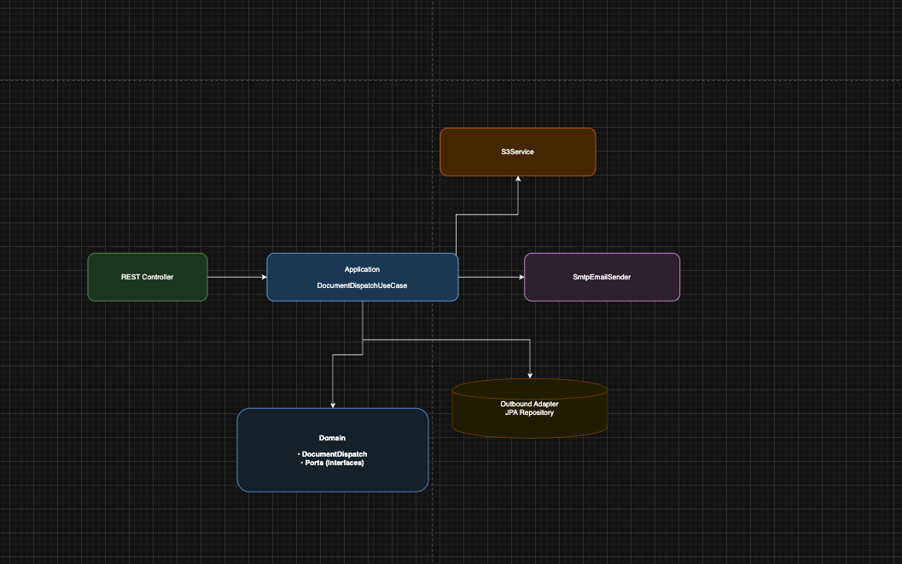

# 📦 Image Dispatch Service
Serviço responsável por **receber imagens**, **armazenar no Amazon S3**, **enviar notificação por e-mail** e **persistir os dados do dispatch**.

O projeto segue **boas práticas de Clean Architecture**, separando domínio, casos de uso, infraestrutura e camada de apresentação.
---

---
## 🧱 Tecnologias utilizadas
- **API**: Spring Boot (Java 17)
- **Banco de Dados**: PostgreSQL 15
- **Armazenamento**: Amazon S3
- **Email**: SMTP
- **Containerização**: Docker + Docker Compose
---



## 🚀 Funcionalidades
- Upload de imagem via API REST
- Armazenamento do arquivo no Amazon S3
- Envio de e-mail de notificação (SMTP ou AWS SES)
- Persistência dos metadados no banco de dados
- Tratamento centralizado de exceções
- Arquitetura limpa e desacoplada

---
## 🧱 Arquitetura
O fluxo principal segue a ordem:

**Controller → UseCase → S3 → Email → Banco**

- **Controller**: recebe a requisição HTTP
- **UseCase**: orquestra o fluxo de negócio
- **S3Service**: faz upload do arquivo
- **EmailSender**: envia notificação
- **Repository**: persiste os dados
---

## 📂 Estrutura do Projeto
```text

src/main/java/com/br/image/image_dispatch_service
├── domain
│   ├── imagedispatch
│   │   ├── model
│   │   │   └── DocumentDispatch.java
│   │   ├── repository
│   │   │   └── DocumentDispatchRepository.java
│   │   └── exceptions
│   │       └── DocumentDispatchGeneralException.java
│   └── mail
│       └── EmailSender.java
│
├── application
│   └── usecase
│       └── imagedispatch
│           ├── DocumentDispatchUseCase.java
│           └── impl
│               └── DocumentDispatchUseCaseImpl.java
│
├── infrastructure
│   ├── aws
│   │   └── S3Service.java
│   ├── mail
│   │   ├── SmtpEmailSender.java
│   │   └── SesEmailSender.java
│   ├── persistence
│   │   ├── config
│   │   │   ├── AwsConfig.java
│   │   │   └── UseCaseConfig.java
│   │   └── jpa
│   │       ├── DocumentDispatchEntity.java
│   │       └── DocumentDispatchJpaRepository.java
│
├── presentation
│   ├── controller
│   │   ├── DocumentDispatchController.java
│   │   └── GlobalExceptionHandler.java
│
└── ImageDispatchServiceApplication.java
